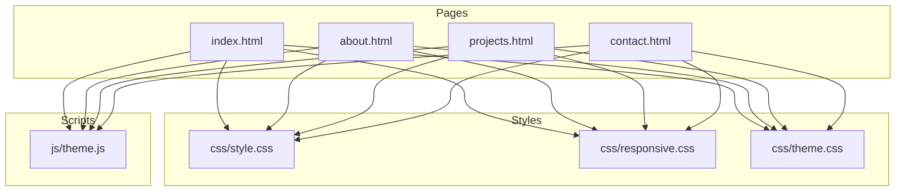
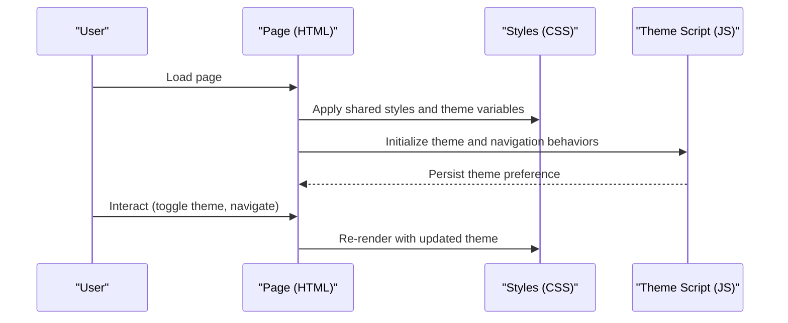
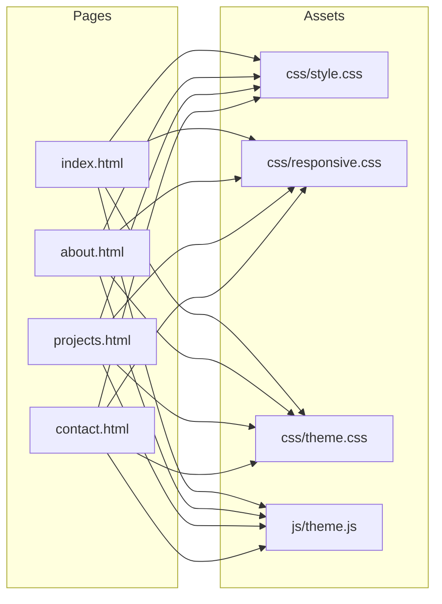

# Core Pages Documentation

<cite>
**Referenced Files in This Document**
- [index.html](file://portfolio/index.html)
- [about.html](file://portfolio/about.html)
- [projects.html](file://portfolio/projects.html)
- [contact.html](file://portfolio/contact.html)
- [style.css](file://portfolio/css/style.css)
- [responsive.css](file://portfolio/css/responsive.css)
- [theme.css](file://portfolio/css/theme.css)
- [theme.js](file://portfolio/js/theme.js)
</cite>

## Table of Contents
1. [Introduction](#introduction)
2. [Project Structure](#project-structure)
3. [Core Components](#core-components)
4. [Architecture Overview](#architecture-overview)
5. [Detailed Component Analysis](#detailed-component-analysis)
6. [Dependency Analysis](#dependency-analysis)
7. [Performance Considerations](#performance-considerations)
8. [Troubleshooting Guide](#troubleshooting-guide)
9. [Conclusion](#conclusion)
10. [Appendices](#appendices)

## Introduction
This document provides comprehensive documentation for all core pages of the portfolio website. It explains each page's purpose, semantic HTML structure, navigation consistency, integration with shared styling, responsive behavior, accessibility considerations, and customization options. It also includes examples for modifying content, adding new sections, and maintaining consistency across pages.

## Project Structure
The portfolio site is organized into clear layers:
- Pages: index.html, about.html, projects.html, contact.html
- Shared styles: css/style.css, css/responsive.css, css/theme.css
- Shared scripts: js/theme.js
- Site metadata: sitemap.xml
- Local server helper: server.ps1

[No sources needed since this diagram shows conceptual workflow, not actual code structure]

## Core Components
Shared components and patterns used across pages:
- Global header and navigation with consistent links to index.html, about.html, projects.html, contact.html
- Footer with copyright and social links
- Theme toggle controlled by theme.js
- Responsive breakpoints managed via responsive.css
- CSS custom properties for colors, typography, spacing, and layout tokens defined in theme.css and style.css

Key responsibilities:
- Navigation: Provides consistent routing and active state management
- Theme: Manages light/dark mode persistence and toggling
- Layout: Uses semantic landmarks (header, main, footer) and grid/flex utilities
- Accessibility: Includes skip links, ARIA attributes, keyboard focus states, and sufficient color contrast

Customization points:
- Update site-wide colors and fonts in theme.css
- Adjust breakpoints and mobile layouts in responsive.css
- Extend component classes in style.css
- Add global behaviors in theme.js

**Section sources**
- [index.html](file://portfolio/index.html)
- [about.html](file://portfolio/about.html)
- [projects.html](file://portfolio/projects.html)
- [contact.html](file://portfolio/contact.html)
- [style.css](file://portfolio/css/style.css)
- [responsive.css](file://portfolio/css/responsive.css)
- [theme.css](file://portfolio/css/theme.css)
- [theme.js](file://portfolio/js/theme.js)

## Architecture Overview
The site follows a simple static architecture with shared assets:
- Each page imports the same stylesheet bundle and script
- Theme switching is handled client-side using localStorage
- Responsive design uses media queries and flexible grids
- Semantic HTML ensures accessibility and SEO friendliness

**Diagram sources**
- [index.html](file://portfolio/index.html)
- [about.html](file://portfolio/about.html)
- [projects.html](file://portfolio/projects.html)
- [contact.html](file://portfolio/contact.html)
- [style.css](file://portfolio/css/style.css)
- [responsive.css](file://portfolio/css/responsive.css)
- [theme.css](file://portfolio/css/theme.css)
- [theme.js](file://portfolio/js/theme.js)

## Detailed Component Analysis

### Home Page (index.html)
Purpose:
- Landing page with hero section, brief introduction, and primary calls to action
- Quick navigation to About, Projects, and Contact

Structure:
- Header with logo/site title and navigation links
- Hero section with headline, short description, and CTA buttons
- Optional highlights or featured work preview
- Footer with links and social icons

Key features:
- Clear visual hierarchy and prominent CTAs
- Consistent navigation and footer
- Responsive hero layout with stacked content on small screens

Accessibility:
- Semantic landmarks (header, main, footer)
- Descriptive link text and button labels
- Keyboard navigable menu and focus indicators

Responsive behavior:
- Fluid typography and spacing
- Stacked hero content on narrow viewports
- Touch-friendly tap targets

Customization:
- Edit hero copy and CTAs directly in the page markup
- Adjust hero background and layout via CSS variables and utility classes
- Add new sections below the hero following existing class conventions

Examples:
- Modify hero headline and paragraph text
- Change primary/secondary button styles through theme variables
- Insert a new “Highlights” section using existing grid classes

**Section sources**
- [index.html](file://portfolio/index.html)
- [style.css](file://portfolio/css/style.css)
- [responsive.css](file://portfolio/css/responsive.css)
- [theme.css](file://portfolio/css/theme.css)
- [theme.js](file://portfolio/js/theme.js)

### About Page (about.html)
Purpose:
- Personal information, background, and skills showcase
- Establishes credibility and personality

Structure:
- Header and navigation
- Intro section with photo/avatar and bio
- Skills section with categories and proficiency indicators
- Optional timeline or experience summary
- Footer

Key features:
- Organized skill groups with progress bars or tags
- Clean, readable typography for long-form content
- Visual balance between image and text

Accessibility:
- Alt text for images
- Proper heading order (h1 > h2 > h3)
- Screen-reader friendly lists and tables if used

Responsive behavior:
- Two-column layout collapses to single column on mobile
- Skill bars adapt width and font size
- Image scales proportionally

Customization:
- Update bio text and profile image path
- Add or remove skill categories and items
- Adjust skill visualization style via CSS variables

Examples:
- Add a new skill category under the existing list
- Replace placeholder image with an optimized asset
- Tweak spacing and colors using theme variables

**Section sources**
- [about.html](file://portfolio/about.html)
- [style.css](file://portfolio/css/style.css)
- [responsive.css](file://portfolio/css/responsive.css)
- [theme.css](file://portfolio/css/theme.css)
- [theme.js](file://portfolio/js/theme.js)

### Projects Page (projects.html)
Purpose:
- Portfolio display of projects with thumbnails, titles, descriptions, and links
- Enables visitors to explore work samples

Structure:
- Header and navigation
- Section title and optional filters (if implemented)
- Grid of project cards with image, title, description, and links
- Footer

Key features:
- Card-based layout with hover effects
- Links to live demos and source repositories
- Consistent card sizing and alignment

Accessibility:
- Meaningful link text for each project
- Images include alt text describing the project
- Focus outlines visible for keyboard users

Responsive behavior:
- Multi-column grid adapts to screen width
- Cards stack vertically on small devices
- Tap targets sized appropriately for touch

Customization:
- Add new project cards by duplicating existing card markup
- Update images, titles, descriptions, and URLs
- Adjust grid columns and spacing via CSS variables

Examples:
- Insert a new project card before the closing container
- Change card border radius and shadow using theme variables
- Enable/disable hover animations via CSS flags

**Section sources**
- [projects.html](file://portfolio/projects.html)
- [style.css](file://portfolio/css/style.css)
- [responsive.css](file://portfolio/css/responsive.css)
- [theme.css](file://portfolio/css/theme.css)
- [theme.js](file://portfolio/js/theme.js)

### Contact Page (contact.html)
Purpose:
- Provide a way for visitors to reach out via a form
- Optionally include direct contact details and social links

Structure:
- Header and navigation
- Contact form with fields such as name, email, subject, message
- Submit button and success/error feedback area
- Optional contact info block (email, phone, location)
- Footer

Key features:
- Form validation hints and accessible error messages
- Clear call to action for submission
- Optional inline validation and success messaging

Accessibility:
- Labels associated with inputs
- Error messages linked to inputs via aria-describedby
- Focus management on submit success or failure

Responsive behavior:
- Form fields stack vertically on narrow screens
- Input widths fill available space
- Buttons remain large enough for touch interaction

Customization:
- Add or remove form fields while preserving label/input relationships
- Integrate with a backend endpoint or third-party service
- Style form controls using theme variables and base input styles

Examples:
- Add a new field and corresponding label/message elements
- Connect form submission to a server endpoint or mailto action
- Customize input focus ring color via CSS variables

**Section sources**
- [contact.html](file://portfolio/contact.html)
- [style.css](file://portfolio/css/style.css)
- [responsive.css](file://portfolio/css/responsive.css)
- [theme.css](file://portfolio/css/theme.css)
- [theme.js](file://portfolio/js/theme.js)

## Dependency Analysis
Cross-page dependencies and shared resources:
- All pages reference the same CSS and JS bundles
- Theme variables centralize colors, fonts, and spacing
- Navigation links maintain consistent routes across pages
- Scripts initialize theme behavior and any interactive components

**Diagram sources**
- [index.html](file://portfolio/index.html)
- [about.html](file://portfolio/about.html)
- [projects.html](file://portfolio/projects.html)
- [contact.html](file://portfolio/contact.html)
- [style.css](file://portfolio/css/style.css)
- [responsive.css](file://portfolio/css/responsive.css)
- [theme.css](file://portfolio/css/theme.css)
- [theme.js](file://portfolio/js/theme.js)

**Section sources**
- [index.html](file://portfolio/index.html)
- [about.html](file://portfolio/about.html)
- [projects.html](file://portfolio/projects.html)
- [contact.html](file://portfolio/contact.html)
- [style.css](file://portfolio/css/style.css)
- [responsive.css](file://portfolio/css/responsive.css)
- [theme.css](file://portfolio/css/theme.css)
- [theme.js](file://portfolio/js/theme.js)

## Performance Considerations
- Keep images optimized and use appropriate formats (WebP/AVIF where supported)
- Minimize render-blocking resources; ensure CSS/JS are loaded efficiently
- Use CSS variables to avoid redundant declarations
- Prefer native browser features over heavy libraries
- Lazy-load offscreen images and defer non-critical scripts

[No sources needed since this section provides general guidance]

## Troubleshooting Guide
Common issues and resolutions:
- Theme not persisting: Ensure localStorage is available and not blocked; verify script initialization runs after DOM ready
- Styles not applying: Confirm correct paths to CSS files and no conflicting overrides
- Navigation active state missing: Check that current page URL matches link hrefs and that any script logic updates active classes
- Form submission errors: Validate required fields, check network requests, and confirm backend endpoints are reachable
- Accessibility warnings: Verify labels, roles, and focus order; test with keyboard-only navigation and screen readers

**Section sources**
- [theme.js](file://portfolio/js/theme.js)
- [style.css](file://portfolio/css/style.css)
- [responsive.css](file://portfolio/css/responsive.css)
- [theme.css](file://portfolio/css/theme.css)
- [contact.html](file://portfolio/contact.html)

## Conclusion
The portfolio site uses a clean, consistent architecture with shared styles and scripts across all pages. By leveraging semantic HTML, CSS variables, and responsive design, it remains accessible, customizable, and easy to extend. Follow the customization examples to update content, add sections, and maintain consistency across pages.

[No sources needed since this section summarizes without analyzing specific files]

## Appendices

### How to Modify Content Across Pages
- Update text and links directly in the respective HTML files
- Maintain heading hierarchy and descriptive link text
- Keep navigation links synchronized across all pages

### How to Add New Sections
- Duplicate an existing section’s markup structure
- Assign meaningful IDs and classes consistent with existing patterns
- Apply theme variables for colors and spacing to keep visuals uniform

### Maintaining Consistency
- Use shared CSS classes and variables instead of inline styles
- Keep navigation identical across pages
- Test responsiveness and accessibility on multiple devices and assistive technologies

[No sources needed since this section provides general guidance]