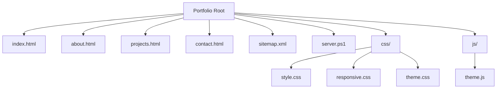
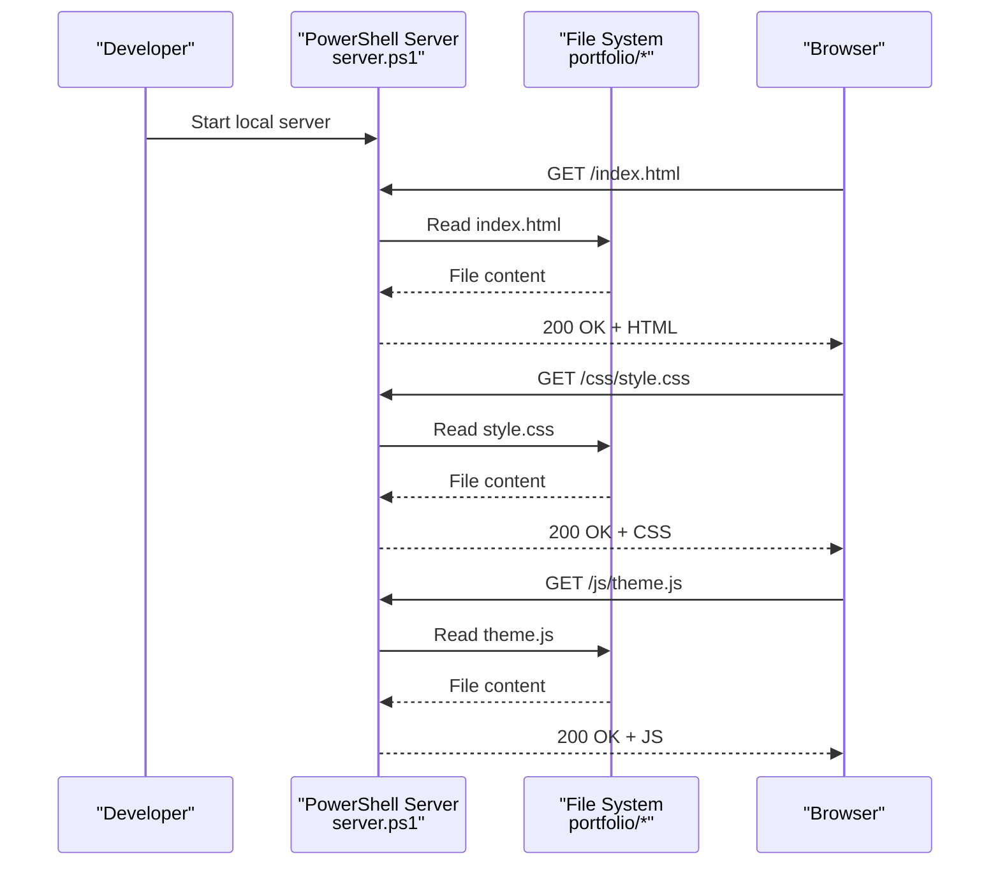
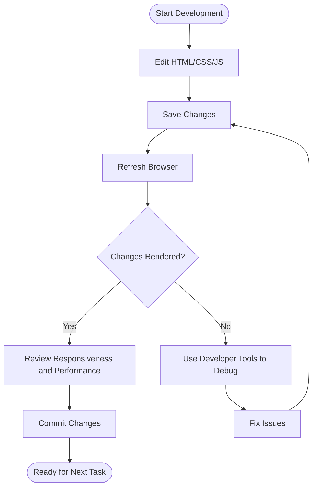
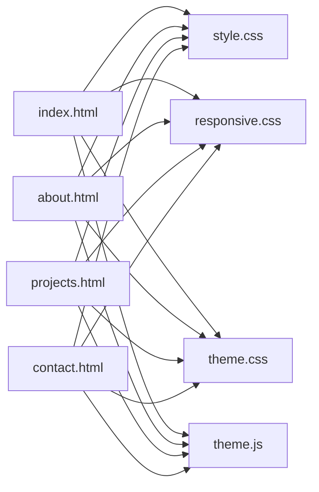

# Development Tools & Configuration

<cite>
**Referenced Files in This Document**
- [server.ps1](file://portfolio/server.ps1)
- [sitemap.xml](file://portfolio/sitemap.xml)
- [index.html](file://portfolio/index.html)
- [about.html](file://portfolio/about.html)
- [projects.html](file://portfolio/projects.html)
- [contact.html](file://portfolio/contact.html)
- [style.css](file://portfolio/css/style.css)
- [responsive.css](file://portfolio/css/responsive.css)
- [theme.css](file://portfolio/css/theme.css)
- [theme.js](file://portfolio/js/theme.js)
</cite>

## Table of Contents
1. [Introduction](#introduction)
2. [Project Structure](#project-structure)
3. [Core Components](#core-components)
4. [Architecture Overview](#architecture-overview)
5. [Detailed Component Analysis](#detailed-component-analysis)
6. [Dependency Analysis](#dependency-analysis)
7. [Performance Considerations](#performance-considerations)
8. [Troubleshooting Guide](#troubleshooting-guide)
9. [Conclusion](#conclusion)
10. [Appendices](#appendices)

## Introduction
This document provides practical guidance for developing and maintaining the portfolio website. It focuses on development tools and configuration, including:
- Running the local PowerShell server (server.ps1), configuring ports, and troubleshooting common issues
- Maintaining sitemap.xml for SEO optimization when adding or updating pages
- Using browser developer tools for debugging, performance monitoring, and responsive design testing
- Version control best practices, file organization during development, and deployment preparation
- Common development workflows and maintenance tasks

The goal is to help you work efficiently and consistently across your team and environments.

## Project Structure
The project follows a simple static site layout with HTML pages, CSS stylesheets, and a small JavaScript module. The root contains the entry page and navigation targets, while assets are organized by type under css/ and js/. A PowerShell script serves the site locally, and a sitemap.xml supports search engine indexing.

[No sources needed since this diagram shows conceptual structure]

## Core Components
- Local development server: server.ps1
- SEO configuration: sitemap.xml
- Pages: index.html, about.html, projects.html, contact.html
- Styles: style.css, responsive.css, theme.css
- Client-side behavior: theme.js

These components together enable local development, SEO-friendly navigation, consistent theming, and basic interactivity.

**Section sources**
- [server.ps1](file://portfolio/server.ps1)
- [sitemap.xml](file://portfolio/sitemap.xml)
- [index.html](file://portfolio/index.html)
- [about.html](file://portfolio/about.html)
- [projects.html](file://portfolio/projects.html)
- [contact.html](file://portfolio/contact.html)
- [style.css](file://portfolio/css/style.css)
- [responsive.css](file://portfolio/css/responsive.css)
- [theme.css](file://portfolio/css/theme.css)
- [theme.js](file://portfolio/js/theme.js)

## Architecture Overview
At runtime during development, the PowerShell script serves static files from the portfolio directory. Browsers request HTML, CSS, JS, and other assets directly from the file system via HTTP. The sitemap.xml remains a static resource that can be requested by crawlers or developers.

**Diagram sources**
- [server.ps1](file://portfolio/server.ps1)
- [index.html](file://portfolio/index.html)
- [style.css](file://portfolio/css/style.css)
- [theme.js](file://portfolio/js/theme.js)

## Detailed Component Analysis

### Local Development Server (server.ps1)
Purpose:
- Serve the portfolio directory over HTTP for local development
- Provide a convenient way to preview changes without external servers

How to run:
- Open PowerShell in the portfolio directory
- Execute the server script to start the local web server
- Open a browser and navigate to the displayed URL

Port configuration:
- If the default port is unavailable, configure an alternative port through the script’s settings before starting the server

Common usage patterns:
- Start the server once per session
- Refresh the browser after editing HTML/CSS/JS to see updates
- Stop the server when finished to free the port

Troubleshooting:
- Port already in use: change the configured port and restart the server
- Permission errors: ensure the script has permission to read files in the portfolio directory
- Browser cannot connect: verify firewall settings and that the server started successfully

Best practices:
- Keep the server running only in the portfolio directory to avoid serving unintended files
- Use a unique port if multiple developers share the same machine

**Section sources**
- [server.ps1](file://portfolio/server.ps1)

### SEO Configuration (sitemap.xml)
Purpose:
- Inform search engines about the site’s URLs and their relative importance
- Help crawlers discover new or updated pages quickly

When to update:
- Add a new page: include its absolute URL and optional metadata such as last modification date and priority
- Change an existing URL: remove the old URL and add the new one
- Update content frequently: adjust the last modification date to reflect recent changes

Maintenance checklist:
- Ensure all public pages are listed
- Verify URLs are correct and accessible
- Remove obsolete entries
- Keep formatting consistent and well-structured

Example workflow:
- Create a new HTML page
- Link it from the main navigation
- Add its URL to sitemap.xml with appropriate metadata
- Test accessibility by requesting the URL directly in a browser

**Section sources**
- [sitemap.xml](file://portfolio/sitemap.xml)
- [index.html](file://portfolio/index.html)
- [about.html](file://portfolio/about.html)
- [projects.html](file://portfolio/projects.html)
- [contact.html](file://portfolio/contact.html)

### Pages and Assets
Pages:
- index.html: Home entry point
- about.html: About section
- projects.html: Projects showcase
- contact.html: Contact information and form links

Styles:
- style.css: Base layout and global styles
- responsive.css: Media queries and breakpoints for mobile/tablet/desktop
- theme.css: Theme variables and color schemes

Client-side logic:
- theme.js: Theme toggling and interactive behaviors

Development tips:
- Prefer semantic HTML elements for better accessibility and SEO
- Organize CSS rules by feature or component to improve maintainability
- Keep theme.js focused on UI interactions; move heavy logic to separate modules if needed

**Section sources**
- [index.html](file://portfolio/index.html)
- [about.html](file://portfolio/about.html)
- [projects.html](file://portfolio/projects.html)
- [contact.html](file://portfolio/contact.html)
- [style.css](file://portfolio/css/style.css)
- [responsive.css](file://portfolio/css/responsive.css)
- [theme.css](file://portfolio/css/theme.css)
- [theme.js](file://portfolio/js/theme.js)

### Conceptual Overview
The following flow illustrates how a typical development cycle integrates the server, pages, styles, and scripts.

[No sources needed since this diagram shows conceptual workflow, not actual code structure]

## Dependency Analysis
The site is static with minimal dependencies:
- HTML pages reference CSS and JS files
- theme.js may depend on DOM APIs and CSS classes defined in stylesheets
- sitemap.xml is independent but should stay in sync with published URLs

**Diagram sources**
- [index.html](file://portfolio/index.html)
- [about.html](file://portfolio/about.html)
- [projects.html](file://portfolio/projects.html)
- [contact.html](file://portfolio/contact.html)
- [style.css](file://portfolio/css/style.css)
- [responsive.css](file://portfolio/css/responsive.css)
- [theme.css](file://portfolio/css/theme.css)
- [theme.js](file://portfolio/js/theme.js)

**Section sources**
- [index.html](file://portfolio/index.html)
- [about.html](file://portfolio/about.html)
- [projects.html](file://portfolio/projects.html)
- [contact.html](file://portfolio/contact.html)
- [style.css](file://portfolio/css/style.css)
- [responsive.css](file://portfolio/css/responsive.css)
- [theme.css](file://portfolio/css/theme.css)
- [theme.js](file://portfolio/js/theme.js)

## Performance Considerations
- Minimize render-blocking resources: keep CSS concise and defer non-critical JS where possible
- Optimize images and assets: compress images and consider modern formats
- Leverage caching: set appropriate cache headers at the hosting layer
- Monitor network and performance: use browser dev tools to identify bottlenecks
- Keep theme.js lightweight: offload heavy operations to Web Workers or backend services if needed

[No sources needed since this section provides general guidance]

## Troubleshooting Guide
Local server issues:
- Port conflicts: change the configured port in the server script and restart
- Access denied: ensure the script runs with permissions to read the portfolio directory
- No output in browser: confirm the server started and check the console for errors

SEO and sitemap:
- Missing pages: verify sitemap.xml includes all public URLs
- Incorrect URLs: test each URL directly in a browser
- Stale entries: remove outdated URLs and update modification dates

Responsive design:
- Breakpoints not applying: inspect computed styles and media queries in dev tools
- Layout shifts: check container widths and flex/grid configurations

JavaScript issues:
- Console errors: open the console and review stack traces
- DOM not ready: ensure scripts execute after DOM is available or use appropriate event listeners

**Section sources**
- [server.ps1](file://portfolio/server.ps1)
- [sitemap.xml](file://portfolio/sitemap.xml)
- [theme.js](file://portfolio/js/theme.js)
- [responsive.css](file://portfolio/css/responsive.css)

## Conclusion
By using the provided PowerShell server, maintaining an up-to-date sitemap, and leveraging browser developer tools, you can develop and iterate efficiently. Follow the version control and file organization recommendations to keep the project clean and collaborative. With these practices, you will be well-prepared for deployment and ongoing maintenance.

[No sources needed since this section summarizes without analyzing specific files]

## Appendices

### Development Workflows
- Feature branch workflow: create a branch, implement changes, commit often, and merge via pull requests
- Code review: ensure peers review changes before merging
- Pre-commit checks: lint CSS/JS and validate HTML semantics

### Version Control Best Practices
- Meaningful commits: write clear messages describing what changed and why
- Atomic changes: group related edits into single commits
- Tag releases: mark stable versions for easy rollback

### Deployment Preparation
- Finalize sitemap.xml: ensure all URLs are present and accurate
- Clean up unused assets: remove temporary files and comments
- Test end-to-end: load critical pages and verify responsiveness and performance

### Maintenance Tasks
- Periodic audits: review broken links and outdated content
- Security hygiene: keep dependencies updated and monitor for vulnerabilities
- Performance reviews: re-run performance tests after major changes

[No sources needed since this section provides general guidance]