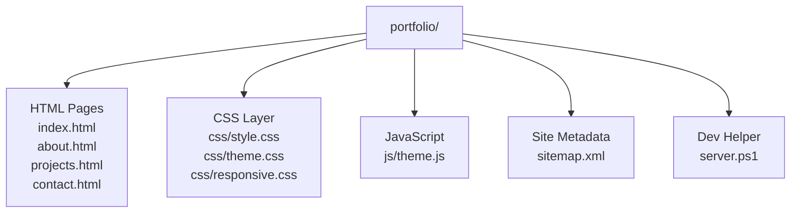
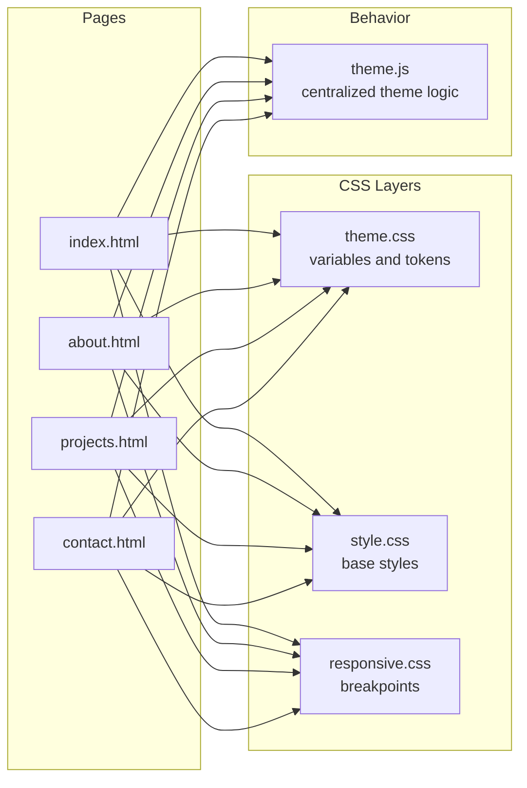
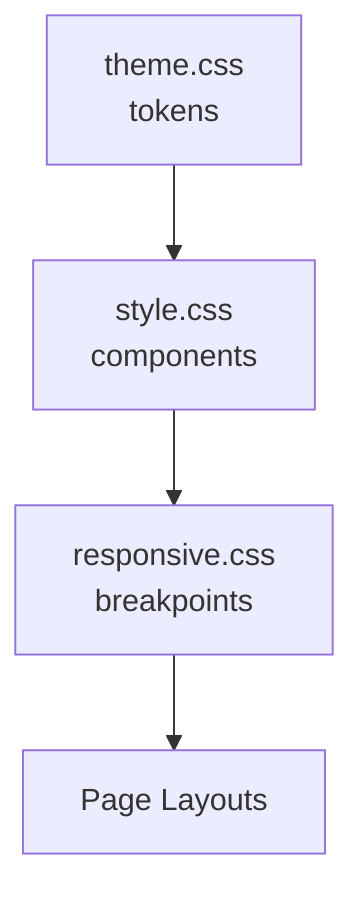
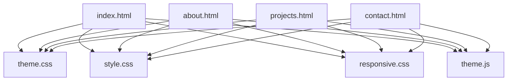

# File Structure & Organization

<cite>
**Referenced Files in This Document**
- [index.html](file://portfolio/index.html)
- [about.html](file://portfolio/about.html)
- [projects.html](file://portfolio/projects.html)
- [contact.html](file://portfolio/contact.html)
- [style.css](file://portfolio/css/style.css)
- [responsive.css](file://portfolio/css/responsive.css)
- [theme.css](file://portfolio/css/theme.css)
- [theme.js](file://portfolio/js/theme.js)
- [server.ps1](file://portfolio/server.ps1)
- [sitemap.xml](file://portfolio/sitemap.xml)
</cite>

## Table of Contents
1. [Introduction](#introduction)
2. [Project Structure](#project-structure)
3. [Core Components](#core-components)
4. [Architecture Overview](#architecture-overview)
5. [Detailed Component Analysis](#detailed-component-analysis)
6. [Dependency Analysis](#dependency-analysis)
7. [Performance Considerations](#performance-considerations)
8. [Troubleshooting Guide](#troubleshooting-guide)
9. [Conclusion](#conclusion)
10. [Appendices](#appendices)

## Introduction
This document explains the portfolio website’s file structure and organization, focusing on separation of concerns across CSS layers, centralized theme management in JavaScript, naming conventions, asset patterns, and how HTML pages reference shared resources. It also provides practical guidance for extending styles and functionality while preserving established patterns.

## Project Structure
The project follows a simple, flat layout with clear separation between content (HTML), presentation (CSS), behavior (JS), and site metadata.

**Diagram sources**
- [index.html](file://portfolio/index.html)
- [about.html](file://portfolio/about.html)
- [projects.html](file://portfolio/projects.html)
- [contact.html](file://portfolio/contact.html)
- [style.css](file://portfolio/css/style.css)
- [theme.css](file://portfolio/css/theme.css)
- [responsive.css](file://portfolio/css/responsive.css)
- [theme.js](file://portfolio/js/theme.js)
- [sitemap.xml](file://portfolio/sitemap.xml)
- [server.ps1](file://portfolio/server.ps1)

**Section sources**
- [index.html](file://portfolio/index.html)
- [about.html](file://portfolio/about.html)
- [projects.html](file://portfolio/projects.html)
- [contact.html](file://portfolio/contact.html)
- [style.css](file://portfolio/css/style.css)
- [theme.css](file://portfolio/css/theme.css)
- [responsive.css](file://portfolio/css/responsive.css)
- [theme.js](file://portfolio/js/theme.js)
- [sitemap.xml](file://portfolio/sitemap.xml)
- [server.ps1](file://portfolio/server.ps1)

## Core Components
- HTML pages: Each page is a standalone document that includes shared CSS and JS via standard link/script tags.
- CSS layering:
  - style.css: Base styles and global resets.
  - responsive.css: Mobile-first breakpoints and responsive rules.
  - theme.css: Theme variables and color tokens.
- JavaScript:
  - theme.js: Centralized theme management (e.g., toggling themes, persisting preferences).
- Site metadata:
  - sitemap.xml: SEO-friendly index of pages.
- Development helper:
  - server.ps1: Local development server script.

**Section sources**
- [index.html](file://portfolio/index.html)
- [about.html](file://portfolio/about.html)
- [projects.html](file://portfolio/projects.html)
- [contact.html](file://portfolio/contact.html)
- [style.css](file://portfolio/css/style.css)
- [responsive.css](file://portfolio/css/responsive.css)
- [theme.css](file://portfolio/css/theme.css)
- [theme.js](file://portfolio/js/theme.js)
- [sitemap.xml](file://portfolio/sitemap.xml)
- [server.ps1](file://portfolio/server.ps1)

## Architecture Overview
The site uses a layered CSS architecture and a single JS module for theming. HTML pages consume these layers in a consistent order to ensure predictable styling and behavior.

**Diagram sources**
- [index.html](file://portfolio/index.html)
- [about.html](file://portfolio/about.html)
- [projects.html](file://portfolio/projects.html)
- [contact.html](file://portfolio/contact.html)
- [theme.css](file://portfolio/css/theme.css)
- [style.css](file://portfolio/css/style.css)
- [responsive.css](file://portfolio/css/responsive.css)
- [theme.js](file://portfolio/js/theme.js)

## Detailed Component Analysis

### CSS Layering and Separation of Concerns
- theme.css: Holds design tokens such as colors, fonts, spacing, and other variables used across components.
- style.css: Contains base typography, layout primitives, and component-level styles that rely on tokens from theme.css.
- responsive.css: Implements mobile-first media queries and overrides to adapt layouts at various viewport widths.

Recommended inclusion order in HTML:
1. theme.css
2. style.css
3. responsive.css

This order ensures variables are defined first, base styles can consume them, and responsive rules can override as needed.

Practical examples:
- Adding a new token: Define it in theme.css so all components can use it consistently.
- Creating a new component: Add markup in the relevant HTML page and write its styles in style.css under a clearly named section.
- Adjusting responsiveness: Add or modify rules in responsive.css using mobile-first breakpoints.

**Section sources**
- [theme.css](file://portfolio/css/theme.css)
- [style.css](file://portfolio/css/style.css)
- [responsive.css](file://portfolio/css/responsive.css)

### JavaScript: Centralized Theme Management
- theme.js encapsulates all theme-related logic, including toggling themes and persisting user preference.
- HTML pages include theme.js once and trigger actions (e.g., button clicks) that call into this module.

Suggested usage pattern:
- Attach event listeners in theme.js to UI controls present across pages.
- Persist the selected theme in local storage so it survives reloads.
- Apply theme classes or attributes to the document root to propagate changes globally.

**Section sources**
- [theme.js](file://portfolio/js/theme.js)

### HTML Page Conventions
- Each page includes shared CSS and JS files using standard link and script tags.
- Keep head sections consistent across pages to maintain predictable load order and behavior.
- Use semantic elements and accessible attributes to improve usability and SEO.

Examples of what to keep consistent:
- The order of CSS imports (theme → base → responsive).
- The placement of the theme script near the end of the body or deferred.
- Naming of data attributes or classes used by theme.js for toggling.

**Section sources**
- [index.html](file://portfolio/index.html)
- [about.html](file://portfolio/about.html)
- [projects.html](file://portfolio/projects.html)
- [contact.html](file://portfolio/contact.html)

### Asset Organization Patterns
- Static assets (images, icons, fonts) should be placed in a dedicated folder (for example, assets/) and referenced via relative paths from HTML/CSS.
- Keep filenames descriptive and lowercase with hyphens for readability.
- Avoid duplicating assets; centralize reusable resources.

[No sources needed since this section provides general guidance]

### File Naming Conventions
- HTML: Lowercase with hyphens (e.g., about.html, projects.html).
- CSS: Lowercase with hyphens; purpose-based names (style.css, responsive.css, theme.css).
- JavaScript: Lowercase with hyphens; feature-based names (theme.js).
- Assets: Lowercase with hyphens; group by type if needed (images/, fonts/, icons/).

[No sources needed since this section provides general guidance]

### How Pages Reference Shared Resources
- Include theme.css before style.css and responsive.css to ensure correct cascade.
- Include theme.js after DOM-ready or defer loading to avoid blocking rendering.
- Maintain consistent paths across all pages to simplify maintenance.

**Section sources**
- [index.html](file://portfolio/index.html)
- [about.html](file://portfolio/about.html)
- [projects.html](file://portfolio/projects.html)
- [contact.html](file://portfolio/contact.html)

### Modular CSS Architecture and Component Relationships
- Tokens (theme.css) feed into base/component styles (style.css).
- Responsive rules (responsive.css) adjust component layouts without altering core styles.
- Components should be scoped with unique class prefixes or sections to minimize conflicts.

**Diagram sources**
- [theme.css](file://portfolio/css/theme.css)
- [style.css](file://portfolio/css/style.css)
- [responsive.css](file://portfolio/css/responsive.css)

**Section sources**
- [theme.css](file://portfolio/css/theme.css)
- [style.css](file://portfolio/css/style.css)
- [responsive.css](file://portfolio/css/responsive.css)

### Practical Examples

#### Add a New Color Token
- Define the token in theme.css.
- Use the token in style.css where applicable.
- Verify appearance on multiple viewports via responsive.css if needed.

**Section sources**
- [theme.css](file://portfolio/css/theme.css)
- [style.css](file://portfolio/css/style.css)
- [responsive.css](file://portfolio/css/responsive.css)

#### Create a New Component
- Add markup in the appropriate HTML page.
- Write styles in style.css under a clearly labeled section.
- If the component needs different behavior on small screens, add rules in responsive.css.

**Section sources**
- [index.html](file://portfolio/index.html)
- [style.css](file://portfolio/css/style.css)
- [responsive.css](file://portfolio/css/responsive.css)

#### Modify Theme Behavior
- Update logic in theme.js (e.g., adding a new theme option).
- Ensure any UI triggers exist in HTML pages and follow the established attribute/class conventions.
- Test persistence and cross-page consistency.

**Section sources**
- [theme.js](file://portfolio/js/theme.js)
- [index.html](file://portfolio/index.html)
- [about.html](file://portfolio/about.html)
- [projects.html](file://portfolio/projects.html)
- [contact.html](file://portfolio/contact.html)

## Dependency Analysis
The dependency graph shows how HTML pages depend on CSS layers and the theme script.

**Diagram sources**
- [index.html](file://portfolio/index.html)
- [about.html](file://portfolio/about.html)
- [projects.html](file://portfolio/projects.html)
- [contact.html](file://portfolio/contact.html)
- [theme.css](file://portfolio/css/theme.css)
- [style.css](file://portfolio/css/style.css)
- [responsive.css](file://portfolio/css/responsive.css)
- [theme.js](file://portfolio/js/theme.js)

**Section sources**
- [index.html](file://portfolio/index.html)
- [about.html](file://portfolio/about.html)
- [projects.html](file://portfolio/projects.html)
- [contact.html](file://portfolio/contact.html)
- [theme.css](file://portfolio/css/theme.css)
- [style.css](file://portfolio/css/style.css)
- [responsive.css](file://portfolio/css/responsive.css)
- [theme.js](file://portfolio/js/theme.js)

## Performance Considerations
- Keep CSS layers minimal and well-scoped to reduce reflows.
- Defer non-critical JavaScript (like theme.js) to avoid blocking initial render.
- Use responsive.css sparingly; prefer flexible layouts when possible.
- Cache static assets appropriately and leverage browser caching headers.

[No sources needed since this section provides general guidance]

## Troubleshooting Guide
- Theme not applying:
  - Confirm theme.css loads before style.css and responsive.css.
  - Verify theme.js is included and runs after the DOM is ready.
- Styles not updating:
  - Clear browser cache or hard refresh.
  - Check for conflicting selectors in responsive.css overriding base styles.
- Cross-page inconsistencies:
  - Ensure all pages include the same CSS/JS references in the same order.
- Local development issues:
  - Use server.ps1 to serve files over HTTP rather than opening HTML directly from disk.

**Section sources**
- [theme.css](file://portfolio/css/theme.css)
- [style.css](file://portfolio/css/style.css)
- [responsive.css](file://portfolio/css/responsive.css)
- [theme.js](file://portfolio/js/theme.js)
- [server.ps1](file://portfolio/server.ps1)

## Conclusion
The portfolio website uses a clean, layered approach: theme variables, base styles, responsive rules, and a single theme management script. By following the established naming conventions, asset organization, and inclusion order, you can extend styles and features predictably while keeping the codebase maintainable and performant.

## Appendices

### Quick Start Checklist
- Always include theme.css, then style.css, then responsive.css.
- Include theme.js once per page, preferably deferred.
- Place new tokens in theme.css and reuse them in style.css.
- Put responsive overrides in responsive.css only when necessary.
- Serve the site locally using server.ps1 during development.

**Section sources**
- [index.html](file://portfolio/index.html)
- [about.html](file://portfolio/about.html)
- [projects.html](file://portfolio/projects.html)
- [contact.html](file://portfolio/contact.html)
- [theme.css](file://portfolio/css/theme.css)
- [style.css](file://portfolio/css/style.css)
- [responsive.css](file://portfolio/css/responsive.css)
- [theme.js](file://portfolio/js/theme.js)
- [server.ps1](file://portfolio/server.ps1)