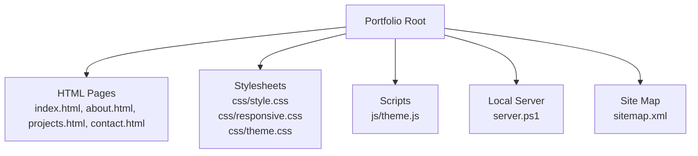
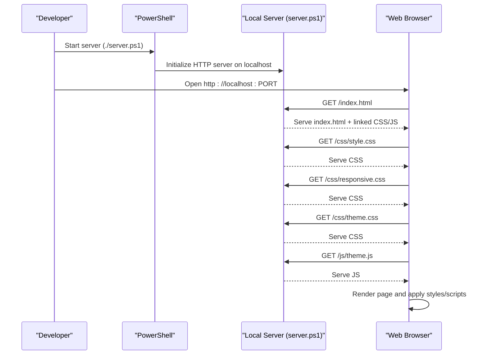

# Getting Started

<cite>
**Referenced Files in This Document**
- [index.html](file://portfolio/index.html)
- [about.html](file://portfolio/about.html)
- [projects.html](file://portfolio/projects.html)
- [contact.html](file://portfolio/contact.html)
- [style.css](file://portfolio/css/style.css)
- [responsive.css](file://portfolio/css/responsive.css)
- [theme.css](file://portfolio/css/theme.css)
- [theme.js](file://portfolio/js/theme.js)
- [server.ps1](file://portfolio/server.ps1)
- [sitemap.xml](file://portfolio/sitemap.xml)
</cite>

## Table of Contents
1. [Introduction](#introduction)
2. [Prerequisites](#prerequisites)
3. [Project Structure](#project-structure)
4. [Installation and Local Development](#installation-and-local-development)
5. [Basic Usage](#basic-usage)
6. [Viewing in Different Browsers](#viewing-in-different-browsers)
7. [Static Website Overview](#static-website-overview)
8. [Troubleshooting](#troubleshooting)
9. [Conclusion](#conclusion)

## Introduction
This guide helps you set up and run the portfolio website locally, navigate its pages, and understand how the static site is organized. It is designed for beginners while still providing enough technical detail for experienced developers to configure their environment quickly.

## Prerequisites
- A modern desktop or laptop computer with an operating system that supports PowerShell (Windows 10/11 recommended).
- Basic familiarity with:
  - HTML structure and semantics
  - CSS styling and responsive design concepts
  - JavaScript basics (for theme toggling behavior)
- A web browser (Chrome, Edge, Firefox, Safari) to view the site.
- Optional: a code editor such as Visual Studio Code for editing files.

No additional software installation is required beyond what is already present on your system.

## Project Structure
The project is a simple static website organized by feature and asset type:
- HTML pages at the root define the main views.
- CSS files under css/ handle layout, responsiveness, and theming.
- JavaScript under js/ provides interactive features like theme switching.
- server.ps1 runs a local HTTP server for development.
- sitemap.xml describes the site’s pages for search engines.

[No sources needed since this diagram shows conceptual structure]

## Installation and Local Development
Follow these steps to run the site locally using the provided PowerShell server script.

Step-by-step setup:
1. Open File Explorer and navigate to the portfolio folder.
2. Right-click anywhere inside the folder while holding Shift, then choose “Open PowerShell window here” (or open PowerShell and use cd to change into the portfolio directory).
3. Run the local server script:
   - Execute: ./server.ps1
4. The script will start a local HTTP server and print a URL (typically http://localhost:PORT).
5. Open the printed URL in your preferred browser to view the site.

Notes:
- If execution policy prevents running scripts, temporarily allow it for the current session by running: Set-ExecutionPolicy -Scope Process -ExecutionPolicy Bypass before executing the server script.
- To stop the server, press Ctrl+C in the terminal where it is running.

What happens when you run the server:
- The script serves the static files from the current directory over HTTP.
- You can navigate between pages via links in the navigation menu.
- Changes to HTML, CSS, or JS are reflected after refreshing the browser.

**Section sources**
- [server.ps1](file://portfolio/server.ps1)

## Basic Usage
After starting the local server and opening the site in your browser:
- Use the top navigation to move between pages:
  - Home: index.html
  - About: about.html
  - Projects: projects.html
  - Contact: contact.html
- Interact with the theme toggle (if available) to switch between light and dark themes.
- Resize your browser window or use mobile view in developer tools to see responsive layouts.

Tips:
- Clicking a link updates the address bar to the corresponding page path.
- Refreshing the page reloads the latest content from disk.

**Section sources**
- [index.html](file://portfolio/index.html)
- [about.html](file://portfolio/about.html)
- [projects.html](file://portfolio/projects.html)
- [contact.html](file://portfolio/contact.html)

## Viewing in Different Browsers
The site is built with standard web technologies and should work across major browsers:
- Google Chrome
- Microsoft Edge
- Mozilla Firefox
- Apple Safari

Recommendations:
- Use the latest stable version of your preferred browser.
- For best results, clear cache if styles or scripts do not appear as expected.
- Use Developer Tools (F12) to inspect elements, check console errors, and simulate mobile devices.

[No sources needed since this section provides general guidance]

## Static Website Overview
How the site works:
- HTML files define the structure and content of each page.
- CSS files provide visual styling, responsive behavior, and theme variables.
- JavaScript adds interactivity, such as toggling themes.
- The local server serves these files over HTTP so they can be viewed in a browser.

File roles:
- index.html: Main landing page.
- about.html: Information about the author.
- projects.html: Showcase of projects.
- contact.html: Contact information and form placeholders.
- style.css: Core layout and component styles.
- responsive.css: Media queries and device-specific adjustments.
- theme.css: Theme variables and color schemes.
- theme.js: Logic for toggling themes and persisting user preference.
- server.ps1: Starts a local HTTP server for development.
- sitemap.xml: Lists pages for search engine indexing.

**Diagram sources**
- [server.ps1](file://portfolio/server.ps1)
- [index.html](file://portfolio/index.html)
- [style.css](file://portfolio/css/style.css)
- [responsive.css](file://portfolio/css/responsive.css)
- [theme.css](file://portfolio/css/theme.css)
- [theme.js](file://portfolio/js/theme.js)

**Section sources**
- [index.html](file://portfolio/index.html)
- [about.html](file://portfolio/about.html)
- [projects.html](file://portfolio/projects.html)
- [contact.html](file://portfolio/contact.html)
- [style.css](file://portfolio/css/style.css)
- [responsive.css](file://portfolio/css/responsive.css)
- [theme.css](file://portfolio/css/theme.css)
- [theme.js](file://portfolio/js/theme.js)
- [server.ps1](file://portfolio/server.ps1)
- [sitemap.xml](file://portfolio/sitemap.xml)

## Troubleshooting
Common issues and resolutions:
- Script cannot run due to execution policy:
  - Allow scripts for the current session: Set-ExecutionPolicy -Scope Process -ExecutionPolicy Bypass
  - Then run ./server.ps1 again.
- Port already in use:
  - Stop any other process using the same port, or modify the server script to use a different port.
- Blank page or missing styles:
  - Ensure all CSS and JS files are present in their respective folders.
  - Clear browser cache and hard refresh (Ctrl+F5 or Cmd+Shift+R).
- Links not working:
  - Verify file names and paths match exactly (case-sensitive on some servers).
- Console errors:
  - Open Developer Tools (F12), go to the Console tab, and fix reported errors.

[No sources needed since this section provides general guidance]

## Conclusion
You now have everything needed to run, explore, and extend the portfolio website locally. Use the navigation to browse pages, tweak styles and scripts to customize the look and feel, and rely on the local server for fast iteration during development.

[No sources needed since this section summarizes without analyzing specific files]