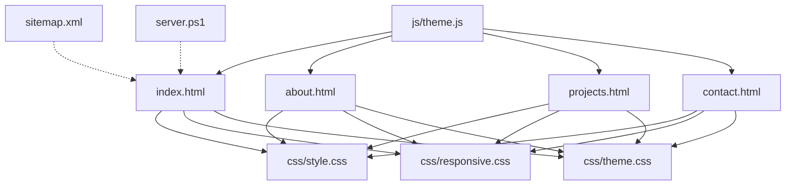
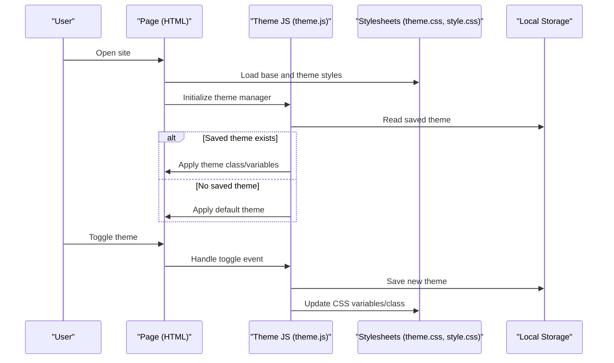
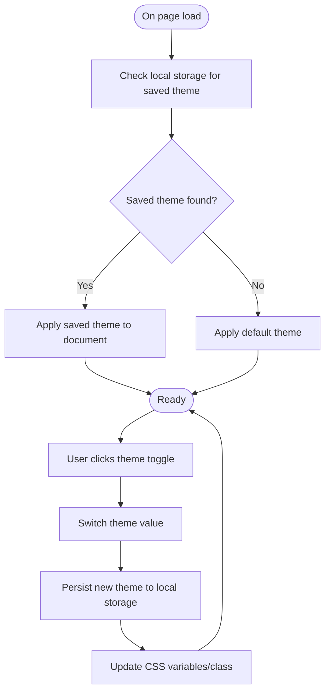
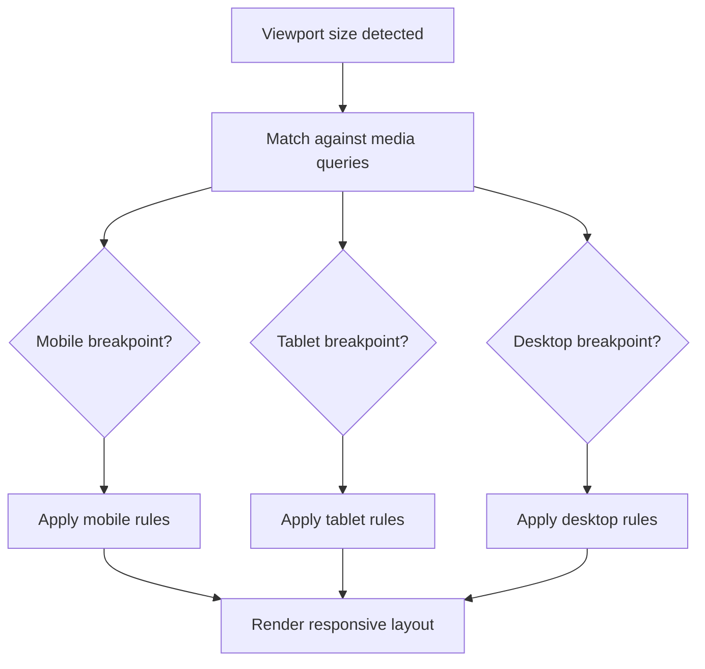
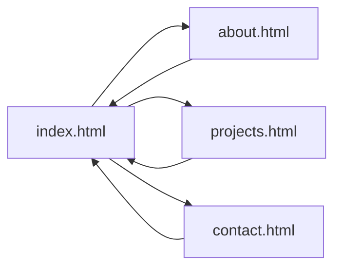
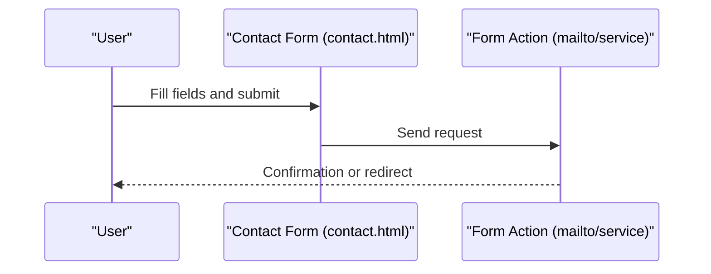
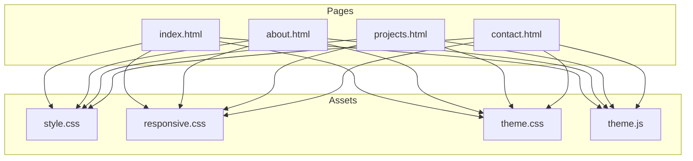

# Project Overview

<cite>
**Referenced Files in This Document**
- [index.html](file://portfolio/index.html)
- [about.html](file://portfolio/about.html)
- [projects.html](file://portfolio/projects.html)
- [contact.html](file://portfolio/contact.html)
- [style.css](file://portfolio/css/style.css)
- [responsive.css](file://portfolio/css/responsive.css)
- [theme.css](file://portfolio/css/theme.css)
- [theme.js](file://portfolio/js/theme.js)
- [server.ps1](file://portfolio/server.ps1)
- [sitemap.xml](file://portfolio/sitemap.xml)
</cite>

## Table of Contents
1. [Introduction](#introduction)
2. [Project Structure](#project-structure)
3. [Core Components](#core-components)
4. [Architecture Overview](#architecture-overview)
5. [Detailed Component Analysis](#detailed-component-analysis)
6. [Dependency Analysis](#dependency-analysis)
7. [Performance Considerations](#performance-considerations)
8. [Troubleshooting Guide](#troubleshooting-guide)
9. [Conclusion](#conclusion)

## Introduction
This project is a static website portfolio designed to showcase personal work, projects, and contact information. It targets job seekers, freelancers, and professionals who want a fast, reliable, and easy-to-maintain online presence without server-side dependencies. The site emphasizes responsive design for seamless viewing across devices, theme management for light/dark modes, and multi-page navigation for clear content organization. As a traditional static website built with vanilla HTML, CSS, and JavaScript, it offers excellent performance, portability, and simplicity.

## Project Structure
The portfolio follows a simple, feature-oriented layout:
- Pages: index.html (home), about.html (about me), projects.html (projects gallery), contact.html (contact form)
- Styles: style.css (base styles), responsive.css (media queries and breakpoints), theme.css (theme variables and overrides)
- Behavior: theme.js (theme switching logic)
- Utilities: sitemap.xml (SEO-friendly site map), server.ps1 (local development helper)

**Diagram sources**
- [index.html](file://portfolio/index.html)
- [about.html](file://portfolio/about.html)
- [projects.html](file://portfolio/projects.html)
- [contact.html](file://portfolio/contact.html)
- [style.css](file://portfolio/css/style.css)
- [responsive.css](file://portfolio/css/responsive.css)
- [theme.css](file://portfolio/css/theme.css)
- [theme.js](file://portfolio/js/theme.js)
- [sitemap.xml](file://portfolio/sitemap.xml)
- [server.ps1](file://portfolio/server.ps1)

**Section sources**
- [index.html](file://portfolio/index.html)
- [about.html](file://portfolio/about.html)
- [projects.html](file://portfolio/projects.html)
- [contact.html](file://portfolio/contact.html)
- [style.css](file://portfolio/css/style.css)
- [responsive.css](file://portfolio/css/responsive.css)
- [theme.css](file://portfolio/css/theme.css)
- [theme.js](file://portfolio/js/theme.js)
- [sitemap.xml](file://portfolio/sitemap.xml)
- [server.ps1](file://portfolio/server.ps1)

## Core Components
- Static pages: Each .html file represents a standalone page that can be served directly by any web server or static host.
- Theme management: A centralized theme system using CSS custom properties and a small JavaScript module to toggle themes and persist user preference.
- Responsive design: Base styles define the default look; responsive.css applies media queries to adapt layouts for mobile, tablet, and desktop.
- Navigation: Multi-page links connect all pages consistently, enabling users to move between Home, About, Projects, and Contact.
- Local development helper: A PowerShell script to serve the site locally during development.

Key implementation references:
- Theme toggling and persistence: [theme.js](file://portfolio/js/theme.js)
- Theme variables and overrides: [theme.css](file://portfolio/css/theme.css)
- Base styling: [style.css](file://portfolio/css/style.css)
- Breakpoints and device-specific rules: [responsive.css](file://portfolio/css/responsive.css)
- Page templates: [index.html](file://portfolio/index.html), [about.html](file://portfolio/about.html), [projects.html](file://portfolio/projects.html), [contact.html](file://portfolio/contact.html)

**Section sources**
- [theme.js](file://portfolio/js/theme.js)
- [theme.css](file://portfolio/css/theme.css)
- [style.css](file://portfolio/css/style.css)
- [responsive.css](file://portfolio/css/responsive.css)
- [index.html](file://portfolio/index.html)
- [about.html](file://portfolio/about.html)
- [projects.html](file://portfolio/projects.html)
- [contact.html](file://portfolio/contact.html)

## Architecture Overview
The portfolio is a classic multi-page static website. There is no build step or runtime framework. Pages reference shared CSS and JS assets. Theme state is persisted in the browser’s local storage so the selected theme survives reloads.

**Diagram sources**
- [theme.js](file://portfolio/js/theme.js)
- [theme.css](file://portfolio/css/theme.css)
- [style.css](file://portfolio/css/style.css)
- [index.html](file://portfolio/index.html)

## Detailed Component Analysis

### Theme Management
Theme management is implemented with CSS custom properties and a lightweight JavaScript controller. The controller reads the saved preference on load, applies the appropriate theme, and persists changes when the user toggles.

**Diagram sources**
- [theme.js](file://portfolio/js/theme.js)
- [theme.css](file://portfolio/css/theme.css)

**Section sources**
- [theme.js](file://portfolio/js/theme.js)
- [theme.css](file://portfolio/css/theme.css)

### Responsive Design
Responsive behavior is separated into its own stylesheet to keep base styles clean and maintainable. Media queries adjust layout, typography, spacing, and component sizes based on viewport width.

**Diagram sources**
- [responsive.css](file://portfolio/css/responsive.css)
- [style.css](file://portfolio/css/style.css)

**Section sources**
- [responsive.css](file://portfolio/css/responsive.css)
- [style.css](file://portfolio/css/style.css)

### Multi-Page Navigation
Navigation is implemented via standard anchor links between pages. Each page includes shared styles and scripts, ensuring consistent appearance and behavior across the site.

**Diagram sources**
- [index.html](file://portfolio/index.html)
- [about.html](file://portfolio/about.html)
- [projects.html](file://portfolio/projects.html)
- [contact.html](file://portfolio/contact.html)

**Section sources**
- [index.html](file://portfolio/index.html)
- [about.html](file://portfolio/about.html)
- [projects.html](file://portfolio/projects.html)
- [contact.html](file://portfolio/contact.html)

### Contact Form Functionality
The contact page provides a client-side form structure suitable for integration with a third-party email service or backend endpoint. For a pure static deployment, you can point the form action to a mailto handler or a hosted form service.

**Diagram sources**
- [contact.html](file://portfolio/contact.html)

**Section sources**
- [contact.html](file://portfolio/contact.html)

### Local Development Helper
A PowerShell script is included to serve the site locally during development. This allows quick iteration without configuring a full web server.

**Section sources**
- [server.ps1](file://portfolio/server.ps1)

## Dependency Analysis
The site has minimal dependencies:
- HTML pages depend on shared CSS and JS assets.
- Theme behavior depends on CSS custom properties and local storage.
- Responsive behavior depends on media queries in the responsive stylesheet.

**Diagram sources**
- [index.html](file://portfolio/index.html)
- [about.html](file://portfolio/about.html)
- [projects.html](file://portfolio/projects.html)
- [contact.html](file://portfolio/contact.html)
- [style.css](file://portfolio/css/style.css)
- [responsive.css](file://portfolio/css/responsive.css)
- [theme.css](file://portfolio/css/theme.css)
- [theme.js](file://portfolio/js/theme.js)

**Section sources**
- [index.html](file://portfolio/index.html)
- [about.html](file://portfolio/about.html)
- [projects.html](file://portfolio/projects.html)
- [contact.html](file://portfolio/contact.html)
- [style.css](file://portfolio/css/style.css)
- [responsive.css](file://portfolio/css/responsive.css)
- [theme.css](file://portfolio/css/theme.css)
- [theme.js](file://portfolio/js/theme.js)

## Performance Considerations
- Static delivery: All assets are plain files, enabling fast caching and CDN distribution.
- Minimal JavaScript: Only essential behavior is loaded, reducing parse and execution overhead.
- Separation of concerns: Keeping responsive rules separate from base styles improves maintainability and reduces unnecessary rule evaluation.
- Theme persistence: Using local storage avoids extra network requests and ensures instant theme application on reload.

[No sources needed since this section provides general guidance]

## Troubleshooting Guide
- Theme not persisting: Ensure the theme manager runs after DOM ready and that local storage is available. Verify the theme toggle updates both the document class/variables and local storage.
  - References: [theme.js](file://portfolio/js/theme.js), [theme.css](file://portfolio/css/theme.css)
- Styles not applying: Confirm that all CSS files are linked in each page and paths are correct. Check for missing or overridden CSS custom properties.
  - References: [style.css](file://portfolio/css/style.css), [responsive.css](file://portfolio/css/responsive.css), [theme.css](file://portfolio/css/theme.css)
- Responsive issues: Validate media query breakpoints and ensure they match your intended device widths. Test on multiple viewports.
  - References: [responsive.css](file://portfolio/css/responsive.css)
- Navigation broken: Verify anchor href values and that all pages exist at expected paths.
  - References: [index.html](file://portfolio/index.html), [about.html](file://portfolio/about.html), [projects.html](file://portfolio/projects.html), [contact.html](file://portfolio/contact.html)
- Local server problems: If the PowerShell helper fails, run it from an elevated console or adjust execution policy as required by your environment.
  - Reference: [server.ps1](file://portfolio/server.ps1)

**Section sources**
- [theme.js](file://portfolio/js/theme.js)
- [theme.css](file://portfolio/css/theme.css)
- [style.css](file://portfolio/css/style.css)
- [responsive.css](file://portfolio/css/responsive.css)
- [index.html](file://portfolio/index.html)
- [about.html](file://portfolio/about.html)
- [projects.html](file://portfolio/projects.html)
- [contact.html](file://portfolio/contact.html)
- [server.ps1](file://portfolio/server.ps1)

## Conclusion
This portfolio demonstrates a clean, efficient static website architecture. By leveraging vanilla HTML, CSS, and JavaScript, it achieves high performance, broad compatibility, and straightforward maintenance. The modular separation of base styles, responsive rules, and theme management makes the codebase easy to extend. With multi-page navigation and a contact form, it covers common portfolio needs while remaining simple enough for beginners to understand and experienced developers to customize quickly.

[No sources needed since this section summarizes without analyzing specific files]