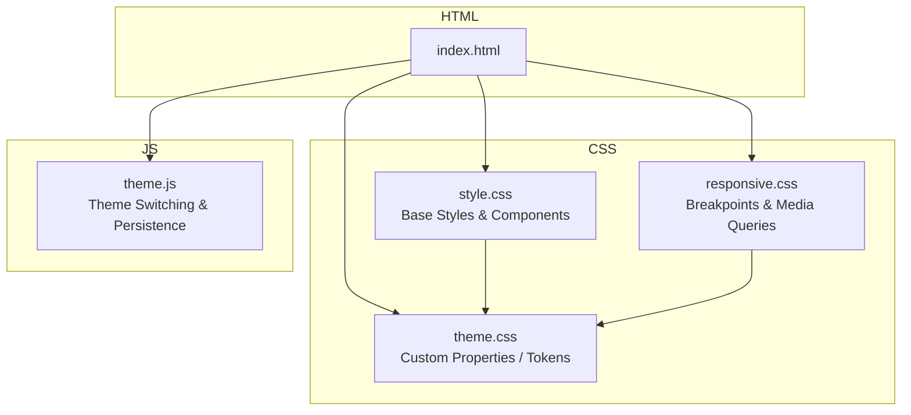
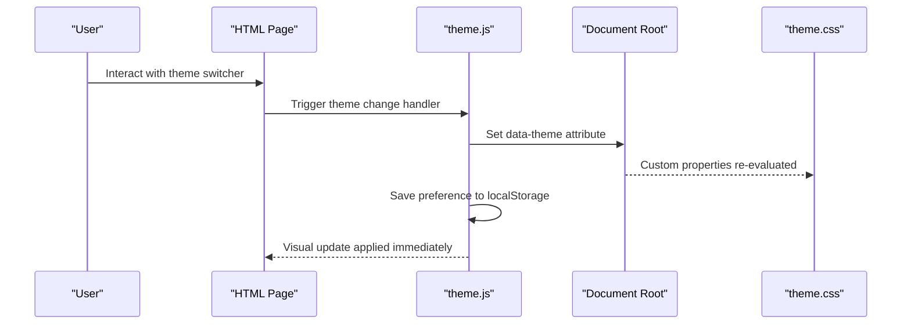
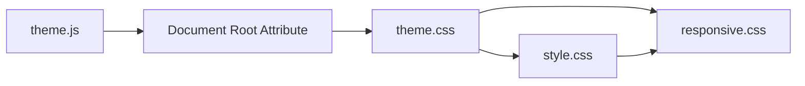

# Styling System & Theme Management

<cite>
**Referenced Files in This Document**
- [style.css](file://portfolio/css/style.css)
- [responsive.css](file://portfolio/css/responsive.css)
- [theme.css](file://portfolio/css/theme.css)
- [theme.js](file://portfolio/js/theme.js)
- [index.html](file://portfolio/index.html)
</cite>

## Table of Contents
1. [Introduction](#introduction)
2. [Project Structure](#project-structure)
3. [Core Components](#core-components)
4. [Architecture Overview](#architecture-overview)
5. [Detailed Component Analysis](#detailed-component-analysis)
6. [Dependency Analysis](#dependency-analysis)
7. [Performance Considerations](#performance-considerations)
8. [Troubleshooting Guide](#troubleshooting-guide)
9. [Conclusion](#conclusion)

## Introduction
This document explains the styling system and theme management of the portfolio website. It covers the modular CSS architecture (base styles, responsive rules, and theme variables), the implementation of CSS custom properties for theming, the mobile-first responsive strategy, and the JavaScript-driven theme switching with persistence across sessions. It also includes guidance for adding new color schemes, customizing colors, fonts, and layout while preserving responsiveness, as well as cross-browser compatibility and performance optimization techniques.

## Project Structure
The styling system is organized into three primary CSS files and a dedicated JavaScript module for theme switching:
- Base styles and global components are defined in style.css.
- Responsive breakpoints and media queries are centralized in responsive.css.
- Theme variables and color tokens live in theme.css.
- The theme switching logic and persistence are implemented in theme.js.
- HTML pages include these assets to apply styles and enable dynamic themes.

**Diagram sources**
- [index.html](file://portfolio/index.html)
- [theme.css](file://portfolio/css/theme.css)
- [style.css](file://portfolio/css/style.css)
- [responsive.css](file://portfolio/css/responsive.css)
- [theme.js](file://portfolio/js/theme.js)

**Section sources**
- [index.html](file://portfolio/index.html)

## Core Components
- theme.css: Declares CSS custom properties for colors, typography, spacing, shadows, and other design tokens. It supports multiple themes via data attributes or class toggles on the root element.
- style.css: Implements base resets, global typography, layout primitives, and component styles that consume tokens from theme.css.
- responsive.css: Defines mobile-first breakpoints and media queries to adapt layouts, spacing, and component behavior across devices.
- theme.js: Manages runtime theme selection, persists user preference using localStorage, and updates the DOM to reflect the active theme.

Key responsibilities:
- Centralize design tokens in theme.css to ensure consistency and easy customization.
- Keep base styles decoupled from theme values so they remain stable across themes.
- Apply responsive rules in responsive.css to maintain a single source of truth for breakpoints.
- Provide a robust theme switching mechanism in theme.js with persistence and fallbacks.

**Section sources**
- [theme.css](file://portfolio/css/theme.css)
- [style.css](file://portfolio/css/style.css)
- [responsive.css](file://portfolio/css/responsive.css)
- [theme.js](file://portfolio/js/theme.js)

## Architecture Overview
The styling system follows a token-driven, modular approach:
- Tokens layer (theme.css): Provides semantic variables for colors, fonts, spacing, radii, shadows, and z-index scales.
- Base layer (style.css): Uses tokens to build consistent UI elements and layout patterns.
- Responsive layer (responsive.css): Applies media queries to adjust layout and component behavior at specific breakpoints.
- Runtime layer (theme.js): Dynamically switches themes and persists preferences.

**Diagram sources**
- [theme.js](file://portfolio/js/theme.js)
- [theme.css](file://portfolio/css/theme.css)
- [index.html](file://portfolio/index.html)

## Detailed Component Analysis

### CSS Custom Properties and Theming (theme.css)
- Purpose: Define all reusable design tokens under a scoped namespace (for example, using a root-level selector).
- Typical tokens:
  - Colors: light/dark palettes, semantic roles (primary, secondary, success, warning, error), surface/background, text, borders, overlays.
  - Typography: font families, sizes, line heights, weights.
  - Spacing: scale for margins, paddings, gaps.
  - Layout: container widths, grid/gutter settings.
  - Effects: border radius, shadows, transitions.
- Theme variants:
  - Use a data attribute on the root element (for example, data-theme="light" or data-theme="dark") to scope tokens.
  - Each theme block overrides the same set of custom properties to swap visuals without changing selectors.
- Extensibility:
  - Add a new color scheme by defining a new theme block and ensuring all required tokens are present.
  - Maintain naming conventions to avoid conflicts and improve discoverability.

Practical examples:
- Changing brand color globally by updating a single token used throughout the site.
- Adjusting typography scale by modifying size tokens referenced by headings and body text.
- Tweaking layout density by updating spacing tokens consumed by components.

**Section sources**
- [theme.css](file://portfolio/css/theme.css)

### Base Styles and Components (style.css)
- Purpose: Implement global resets, base typography, link/button styles, cards, navigation, forms, and other reusable components.
- Token usage: All visual aspects should reference tokens from theme.css rather than hard-coded values.
- Layering:
  - Global defaults provide a consistent baseline.
  - Component styles compose tokens to achieve theme-aware visuals.
- Maintainability:
  - Prefer small, composable utilities over large monolithic blocks.
  - Keep selectors simple and predictable to minimize specificity issues.

Responsive integration:
- Base styles should be mobile-first; responsive adjustments are delegated to responsive.css.

**Section sources**
- [style.css](file://portfolio/css/style.css)

### Responsive Design Strategy (responsive.css)
- Approach: Mobile-first. Start with default styles for small screens and progressively enhance for larger viewports.
- Breakpoints:
  - Centralized in responsive.css to avoid duplication.
  - Common ranges include small phones, large phones, tablets, laptops, and desktops.
- Patterns:
  - Grid and flex layouts adapt column counts and spacing.
  - Navigation collapses into a menu pattern on smaller screens.
  - Typography scales fluidly using tokens and media queries.
- Best practices:
  - Avoid overlapping breakpoints.
  - Test key flows at each breakpoint.
  - Keep media queries close to related components when necessary, but prefer centralization for consistency.

**Section sources**
- [responsive.css](file://portfolio/css/responsive.css)

### Theme Switching and Persistence (theme.js)
- Responsibilities:
  - Detect current theme from the root element’s data attribute.
  - Listen for user interactions (for example, buttons or dropdowns) to switch themes.
  - Persist the selected theme using localStorage so it survives page reloads and browser restarts.
  - Provide a sensible default theme if no preference exists.
- Flow:
  - On load, read stored preference and apply it to the root element.
  - On user action, update the root attribute and save the choice.
  - Ensure immediate visual feedback by applying changes synchronously.
- Robustness:
  - Guard against missing storage APIs.
  - Handle invalid or unknown theme values by falling back to a default.
  - Avoid FOUC (flash of unstyled content) by applying the theme early in the page lifecycle.

```mermaid
flowchart TD
Start(["Page Load"]) --> CheckStorage["Read stored theme from localStorage"]
CheckStorage --> HasPref{"Preference exists?"}
HasPref --> |Yes| ApplyStored["Apply stored theme to root"]
HasPref --> |No| ApplyDefault["Apply default theme to root"]
ApplyStored --> Ready(["Ready"])
ApplyDefault --> Ready
Ready --> UserAction["User selects a theme"]
UserAction --> UpdateAttr["Set data-theme on root"]
UpdateAttr --> SavePref["Save preference to localStorage"]
SavePref --> End(["Done"])
```

**Diagram sources**
- [theme.js](file://portfolio/js/theme.js)

**Section sources**
- [theme.js](file://portfolio/js/theme.js)

### Integration with HTML Pages
- Include order:
  - theme.css first to establish tokens.
  - style.css next to apply base styles and components.
  - responsive.css last to override as needed for breakpoints.
  - theme.js near the end of the document or deferred to avoid blocking rendering.
- Early application:
  - To prevent flash of incorrect theme, apply the theme before styles render by setting the data attribute inline in the HTML head or via a minimal script executed early.

**Section sources**
- [index.html](file://portfolio/index.html)

## Dependency Analysis
- theme.css has no dependencies on other CSS files.
- style.css depends on theme.css for tokens.
- responsive.css depends on theme.css and style.css for contextual overrides.
- theme.js depends on the DOM and localStorage API; it does not depend on CSS directly but influences which tokens are active.

**Diagram sources**
- [theme.css](file://portfolio/css/theme.css)
- [style.css](file://portfolio/css/style.css)
- [responsive.css](file://portfolio/css/responsive.css)
- [theme.js](file://portfolio/js/theme.js)

**Section sources**
- [theme.css](file://portfolio/css/theme.css)
- [style.css](file://portfolio/css/style.css)
- [responsive.css](file://portfolio/css/responsive.css)
- [theme.js](file://portfolio/js/theme.js)

## Performance Considerations
- Minimize repaint/reflow:
  - Toggle a single attribute on the root element instead of rewriting large style blocks.
  - Batch DOM updates and avoid synchronous layout reads/writes in loops.
- Reduce CSS payload:
  - Remove unused tokens and comments in production builds.
  - Leverage CSS minification and HTTP/2 multiplexing.
- Improve perceived performance:
  - Defer non-critical scripts.
  - Inline critical CSS for above-the-fold content if needed.
- Optimize images and assets:
  - Use modern formats and appropriate sizing.
- Accessibility:
  - Ensure sufficient contrast in all themes.
  - Respect prefers-color-scheme and allow users to override.

[No sources needed since this section provides general guidance]

## Troubleshooting Guide
Common issues and resolutions:
- Theme not persisting:
  - Verify localStorage availability and permissions.
  - Confirm the script runs after the DOM is ready or use an early inline script to set the attribute.
- Flash of wrong theme:
  - Move theme application to the document head or use a minimal inline script before styles load.
- Tokens missing in a theme:
  - Ensure every theme defines all required custom properties referenced by style.css.
- Overridden styles not taking effect:
  - Check CSS specificity and load order; ensure responsive.css loads after style.css.
- Cross-browser inconsistencies:
  - Validate CSS custom property support and provide graceful fallbacks where necessary.
  - Test on major browsers and handle edge cases like older Safari versions.

**Section sources**
- [theme.js](file://portfolio/js/theme.js)
- [theme.css](file://portfolio/css/theme.css)
- [style.css](file://portfolio/css/style.css)
- [responsive.css](file://portfolio/css/responsive.css)

## Conclusion
The styling system is built around a clear separation of concerns: tokens in theme.css, base styles in style.css, responsive rules in responsive.css, and runtime control in theme.js. This modular architecture enables consistent theming, easy customization, and maintainable responsive behavior. By following the guidelines for adding new color schemes, customizing tokens, and optimizing performance, you can extend the system confidently while preserving accessibility and cross-browser compatibility.